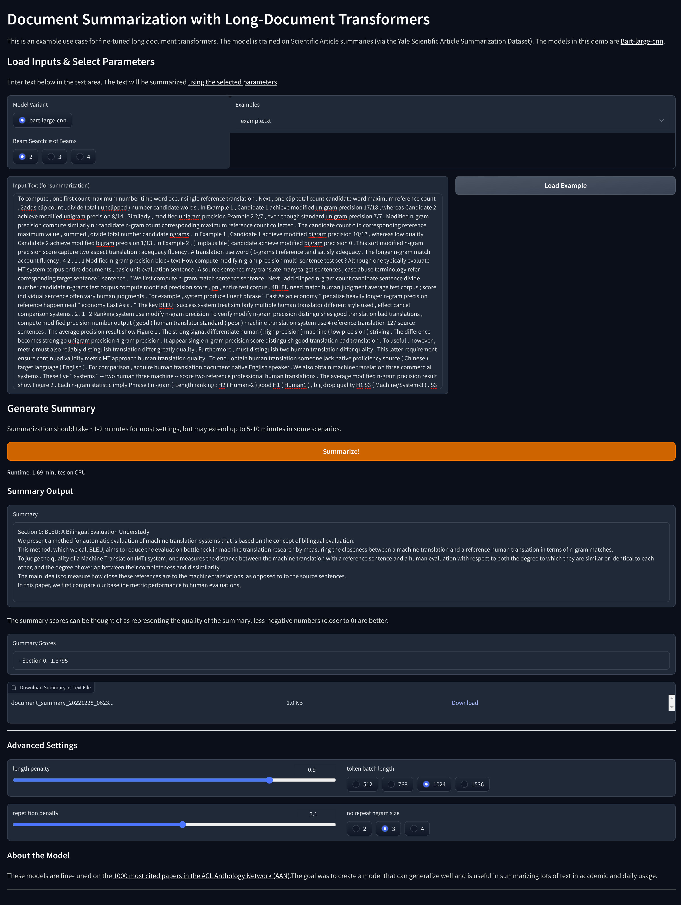

# **Long Document Summarization Task**
---------------------------------------------------------------------------------------------

## **[Playground](https://huggingface.co/spaces/SmartPy/ScisummNet)**

* A space to  easily summarize the long documents and download the summary.
* one can also play with the model parameters to get the best results.

## **Introduction**
--------------------------------

* I have done extractive summarization followed by an abstractive summarization on the Scicummnet dataset to summarize the long documents.

* The Eda is done on the dataset and is demonstrated in notebook. 

## **Dataset**
--------------------------------

* The dataset is a collection of scientific papers from the [SciCummnets](https://www.aclweb.org/anthology/2020.acl-main.1/) dataset.
* The dataset contains 1000 papers in total.
* The dataset contains text in xml format, so I have used [xml](https://docs.python.org/3/library/xml.etree.elementtree.html) library to extract the text from the xml files.

## **Preprocessing**
--------------------------------

* Removed Punctuations, Stopwords, Special Characters, Numbers, and unnecessary spaces.

## **Extractive Summarization**
--------------------------------

### Since extractive summariztion is an unsupervised techneque, I have used textRank algorithm which is based on google's page rank algorithm.
* Its a graph based algorithm in which an importance score is estimated for each sentence.
* This algorithm takes the interdependence of sentences on one another in account.
* After that top sentences are selected based on their importance scores to represent the candidate summary.
* For representing relationships I used embeddings by sentence-transformers model i.e. [all-mpnet-base-v2 model](https://huggingface.co/microsoft/mpnet-base).
* Note that order of sentences are preserved after picking the top sentences. 

## **Abstractive Summarization**
--------------------------------

* For abstractive summarization I have finetuned (bart-large-cnn)[https://huggingface.co/facebook/bart-large-cnn] model on the [Scicummnet dataset](https://arxiv.org/pdf/1909.01716.pdf).
* Since the model takes a maximum of 1024 tokens extractive summarization is done on the original text and distributions of lengths of text, summary and extractive summary are observed accordingly.
* Fine Tuned Model link : [bart-large-cnn-finetuned-scientific_summarize](https://huggingface.co/SmartPy/bart-large-cnn-finetuned-scientific_summarize) 

## **Results**
--------------------------------

* The results are good, but I think it can be improved by using more data.
* The results are demonstrated in the form of a pdf file in the results folder : [results/summarization-report.pdf](results/summarization-report.pdf)

## **Libraries**
--------------------------------

* [transformers](https://huggingface.co/transformers/)
* [sentence-transformers](https://www.sbert.net/)
* [torch](https://pytorch.org/)
* [gradio](https://gradio.app/)
* [accelerate](https://huggingface.co/docs/accelerate/)
* [wandb](https://wandb.ai/site)
* [datasets](https://huggingface.co/docs/datasets/)
* [xml](https://docs.python.org/3/library/xml.etree.elementtree.html)
* [nltk](https://www.nltk.org/)
* [numpy](https://numpy.org/)
* [pandas](https://pandas.pydata.org/)
* [matplotlib](https://matplotlib.org/)
* [seaborn](https://seaborn.pydata.org/)

## **Screenshots**
--------------------------------

